 
# Armiarma Metrics on Medalla Testnet

On the current evolution state of the Ethereum2 project, the beacon chain and the different clients have proved to be working as expected. It has already been a bit more than three months since the medalla testnet was launched as the main event on the eth2 phase0, and it has become a pretty enriching experience for all. 
Despite few critical situations, like long periods of non finalization, and many solved bugs, the medalla testnet and the beacon chain have proved that the eth2 project is, so far, a feasible idea.
Before moving to the next phase assuming that everything works fine, the community has included the network healthiness monitoring to the project priorities. The researchers community has gained prominence for providing analysis and reports about how the testnet and the clients are performing. And so we are the BSC-ETH2 team presenting our Armiarma Project.

## Armiarma Crawler

Armiarma appears from that need of monitoring the testnet, and aims to be a tool that provides meaningful data about the performance of the GossipSub protocol and the peers on the Eth2 testnet. 

When talking about eth2 debugging tools, it isn’t possible not to talk about Rumor. Rumor, developed to generate custom p2p hosts able to interact with the Eth2 network, showed a huge potential on debugging the eth2 p2p network, becoming the ideal base we could use to build a network monitor.
Armiarma is divided into two main parts:
1. The Network Crawler. A slightly tuned Rumor version used to gather the information about  the GossipSub implementation and peers.
2. The Data Analysis. Used to analyze and plot the gathered metrics from the crawler.

*NOTE: Rumor is a tool that is currently in development. So that the Armiarma Implementation is constantly improving and adding new features or gathering new metrics from the network.*

## Metrics from Medalla Testnet

As it was explained before, Armiarma crawler focuses on the p2p network information. It stores the information from the peers we have received from the dv5 protocol, as the information of the peers we have been connected to. 
Once we have been connected to a peer, it records:
1. Information about the peer:
- Peer Id
- Node Id
- Client Type and version
- Pubkey
- MultiAddress
- IP
- Country
- City
- Latency
2. The connection/disconnection events with the time of the events
3. A Counter of every message we have received from each peer on the five main GossipSub topics of Eth2:
- beacon_block
- beacon_aggregate_and_proof
- voluntary_exit
- proposer_slashing
- attester_slashing

*NOTE: The data used to generate the plots that will be shown below has been taken with the alpha version of the crawler (non optimized version). This plots and results will be updated with new ones once the code is merged with the [recent update of rumor](https://github.com/protolambda/rumor/commit/6549267e93d4f409731d0e59ae45863347b0b226)*

## Results

On a deeper analysis of the received metrics, this is the data we have been able to collect and extract from the network.

*NOTE: the data used for generating the following charts was gathered from the Armiarma crawler during few hours. The conclusions that can be obtained from this report might be biased by the root nodes used on the dv5 protocol.*

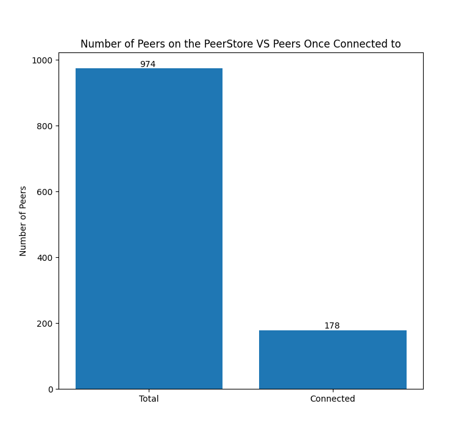

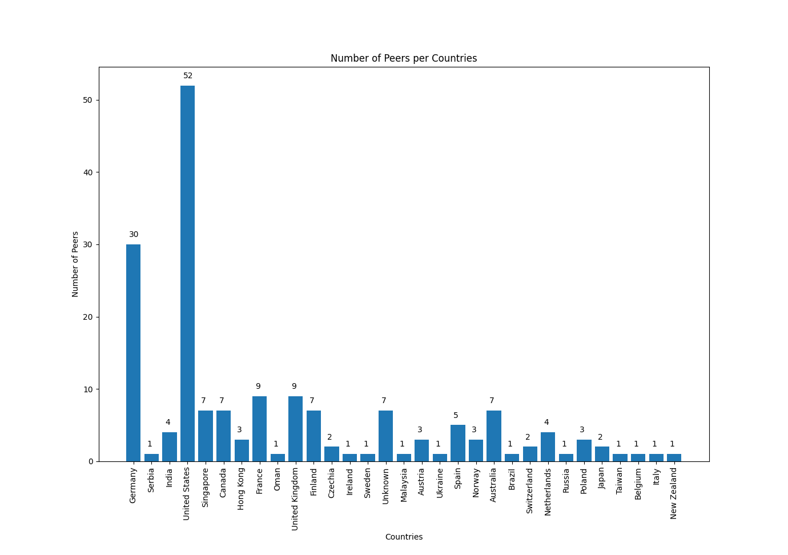

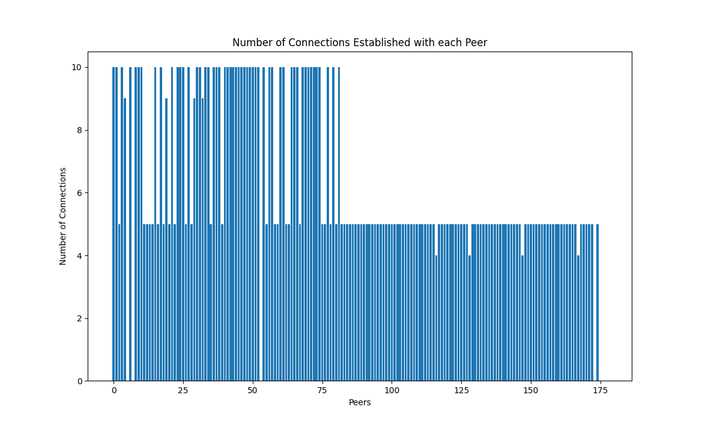
*Note: The connection events are one per each GossipSub Topic (Connected to 5 topics in total)*

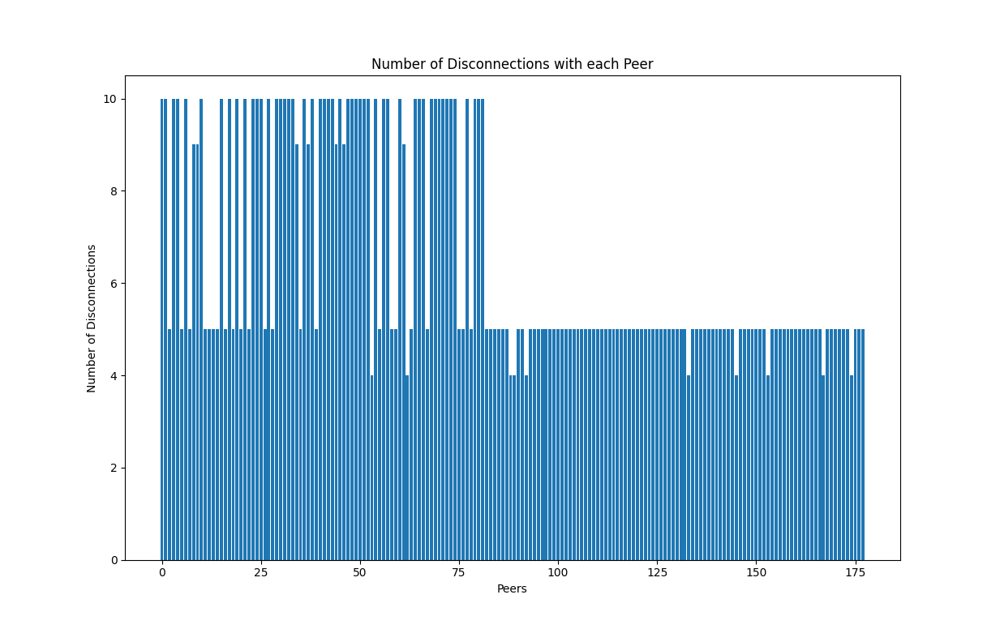
*Note: The connection events are one per each GossipSub Topic (Connected to 5 topics in total)*

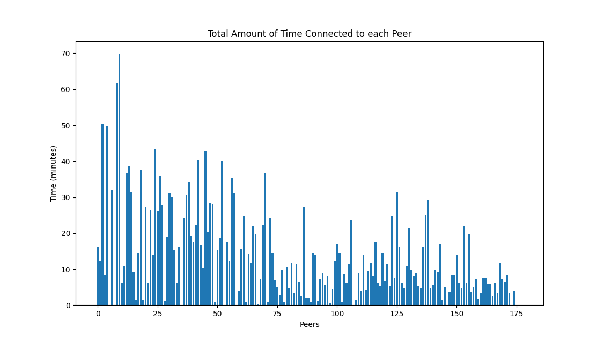
*Note: The total amount of time is the sum of the time connected to each GossipSub Topic (Connected to 5 topics in total)*

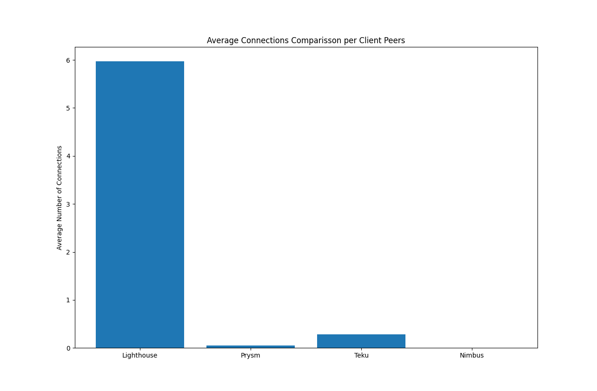
*Note: The average was made from the total amount of connections shown previously.*

*Note: The average was made from the total amount of disconnections shown previously.*

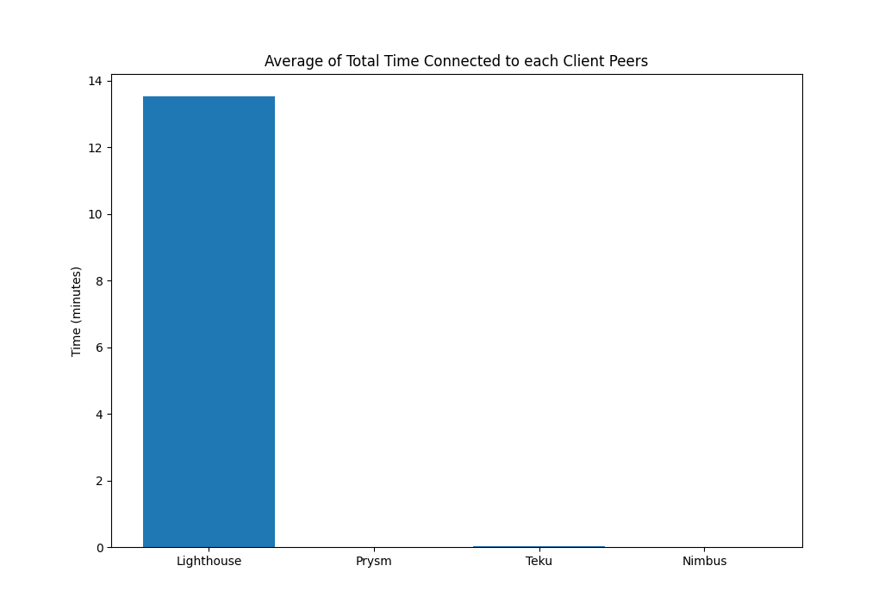
*Note: The average was made from the total amount of time shown previously.*

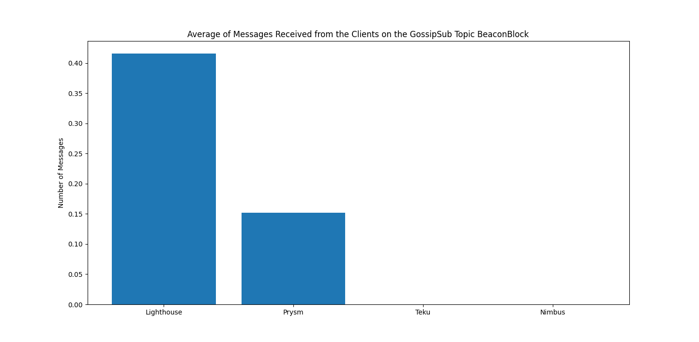

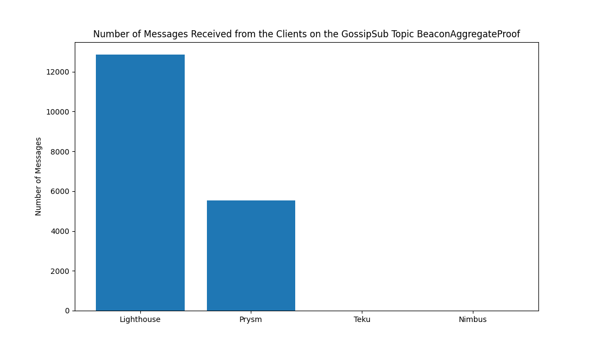

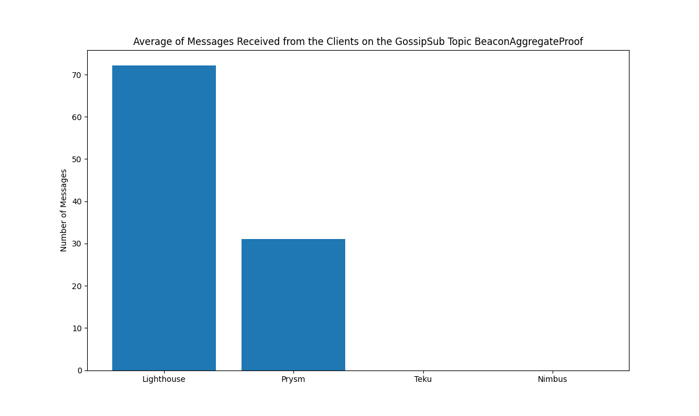

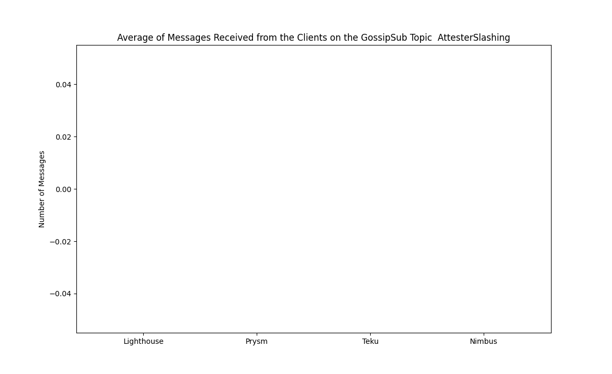
*Note: No messages received on those topics.*

## Conclusion and Future Work

The team has seen projection and potential to keep developing and improving the tool. The merge with the recent updates on Rumor will become an inflexion point on the performance of the crawler, automating the peer connections.

This data is an alpha version of the project, aiming to show the kind of metrics that can be generated from the medalla network. 

For this reason, the team is open to suggestions, new ideas and any feedback the community wants to make.

