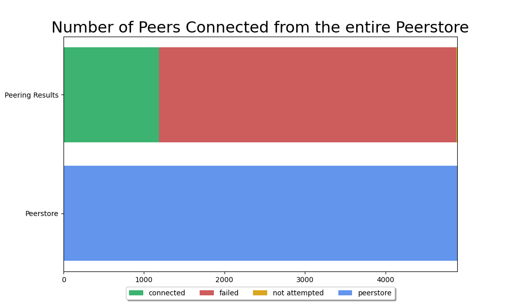
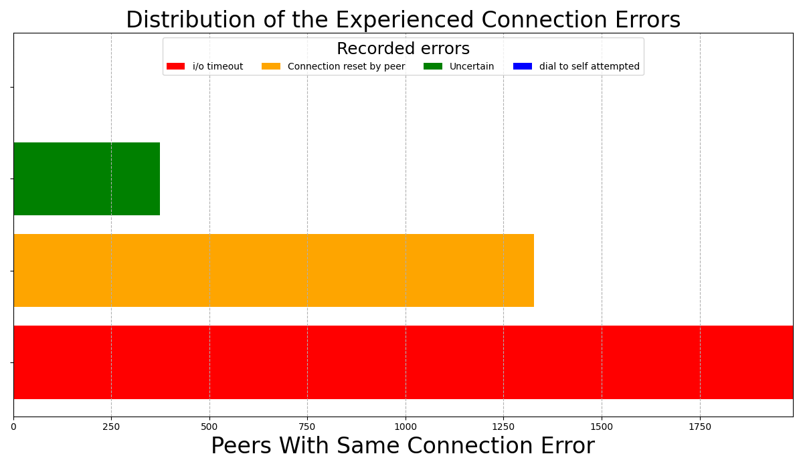
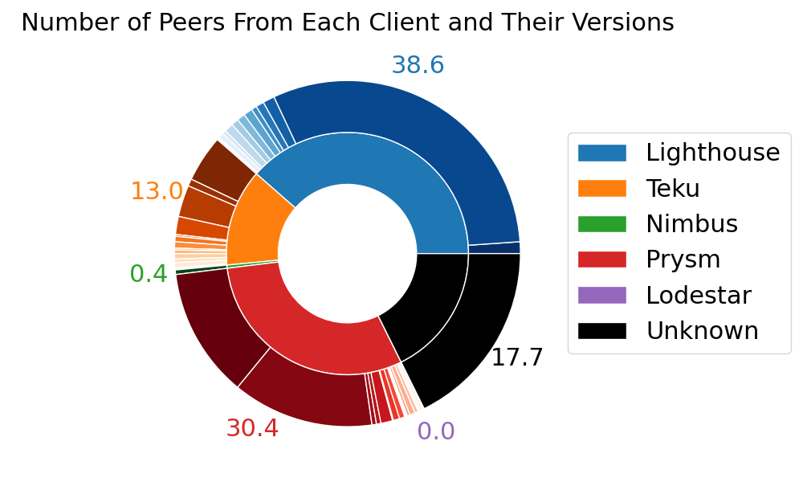
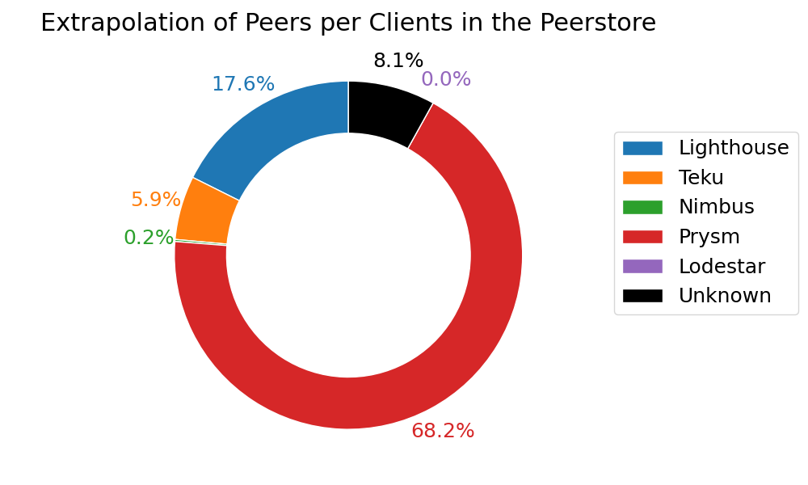
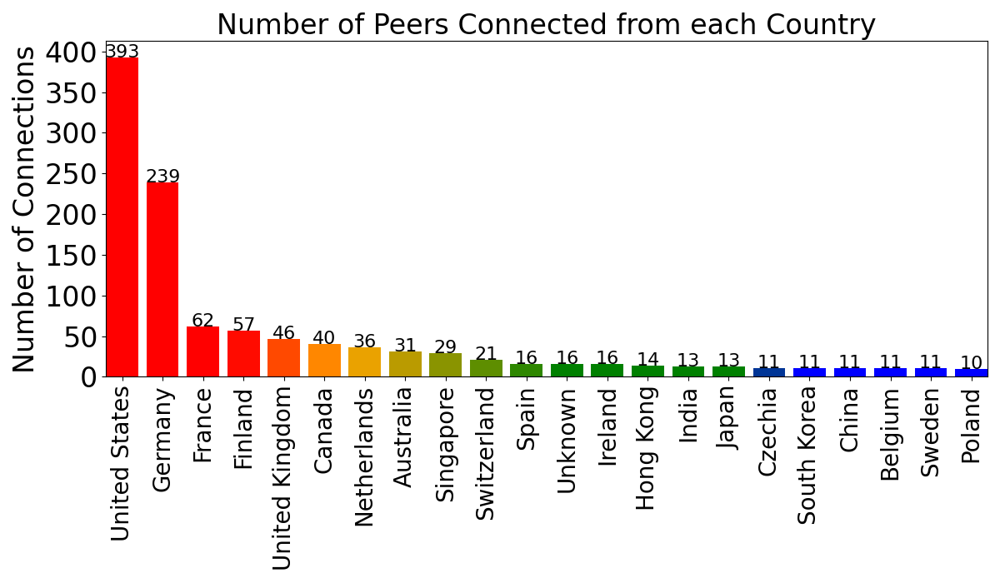
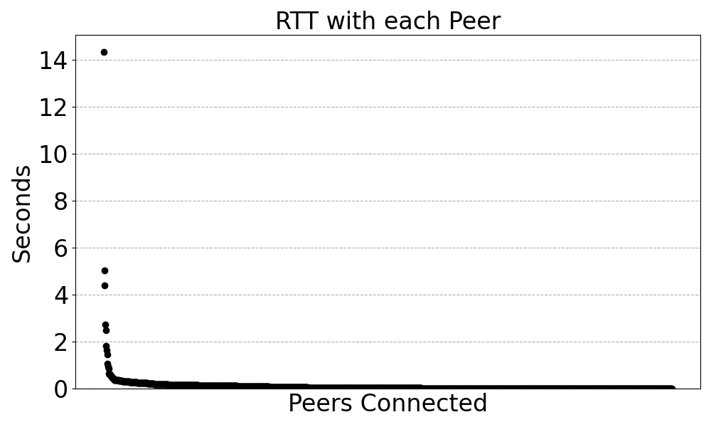
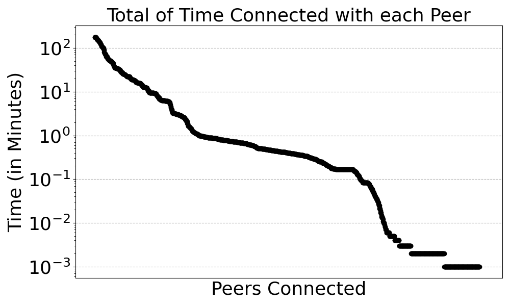
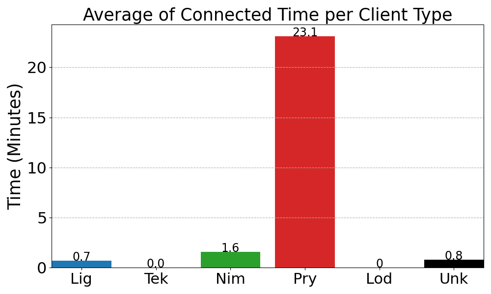
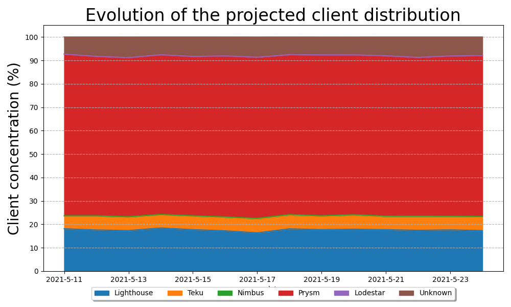

' 
# Armiarma Metrics on Ethereum2 Mainnet

On the current evolution state of the Ethereum2 project, the beacon chain and the different clients have proved to be working as expected. It has already been a bit more than three months since the Ethereum2 mainnet was launched as the main event on the eth2 phase0, and it has become a pretty enriching experience for all. 
Despite few critical situations, like long periods of non finalization, and many solved bugs, the Eth2 mainnet and the beacon chain have proved that the eth2 project is, so far, a feasible idea.
Before moving to the next phase assuming that everything works fine, the community has included the network healthiness monitoring to the project priorities. The researchers community has gained prominence for providing analysis and reports about how the testnet and the clients are performing. And so we are the BSC-ETH2 team presenting our Armiarma Project.

## Armiarma Tool

Armiarma appears from that need of monitoring the testnet, and aims to be a tool that provides meaningful data about the performance of the Eth2 main protocols and the peers on the Eth2 testnet. 

When talking about eth2 debugging tools, it isn’t possible not to talk about Rumor. Rumor, developed to generate custom p2p hosts able to interact with the Eth2 network, showed a huge potential on debugging the eth2 p2p network, becoming the ideal base we could use to build a network monitor.
Armiarma is divided into two main parts:
1. The Network Crawler. A tuned Rumor version used to gather Eth2 protocols' and peer interactions' information.
2. The Data Analysis. Used to analyze and express in human readable grahics the obtained metrics from the crawler.

Link to the [Armiarma repository](https://github.com/Cortze/armiarma) containign the source code of the tool.

Link to the [Miga Labs website](http://migalabs.bsc.es/crawler/) where more info about the project and the results can be obtained. 

*NOTE: Rumor is a tool that is currently in development. So that the Armiarma Implementation is constantly improving and adding new features or gathering new metrics from the network.*

## Results

On a deeper analysis of the received metrics, this is part of the data we have been able to collect and extract from the network. 

*NOTE: the data used for generating the following charts was gathered from the Armiarma crawler during 3 hours. The conclusions that can be obtained from this report might be biased by the short running time and the geographical location of the launched crawler.*

## Conclusion and Future Work

The team has seen projection and potential to keep developing and improving the tool. This data is an alpha version of the project, aiming to show the kind of metrics that can be generated from the medalla network. 

For this reason, the team is open to suggestions, new ideas and any feedback the community wants to make.

