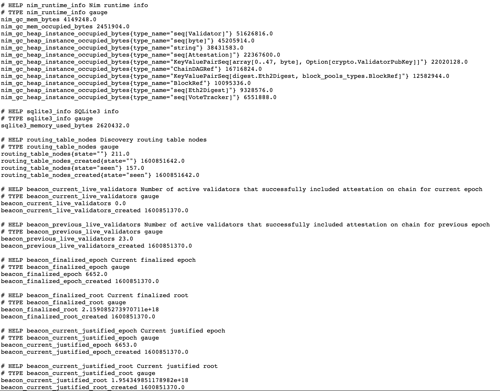
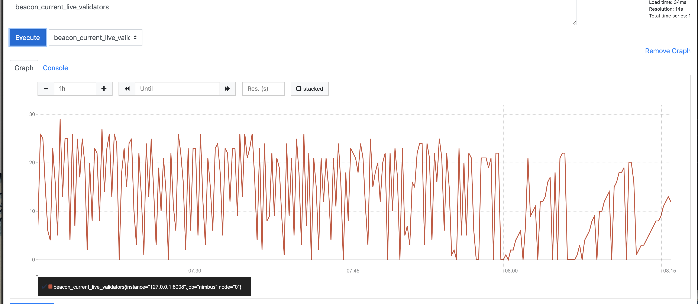

   # State Report

The following report compiles the status of the different projects that the BSC-ETH2 team is working on.

## ETH2 Clients:

### Nimbus:
Nimbus client has been correctly synced and associated with 2 validator keys.

>85a00f49e1c7b926b1c2b3d565939be7135acf2e014c8c67867a16d7544b88dc94370b054768d2da588dbfb10530d709

>A098095c8c3ad34aae95ccd962fbd1352c2f085240c325bd67231e7920e7ed37e19afddf2019f0b953b8fecb6c5097d5

When the command `make medalla-deposit VALIDATORS=2` is launched, the following log appears:
 >Error: unhandled exception: 'walletsCmd' is not accessible using discriminant 'cmd' of type 'BeaconNodeConf' [FieldError].
 

This is a currently [open github issue](https://github.com/status-im/nim-beacon-chain/issues/1683) (labeled as bug).

--------

A Graphana dashboard has been set and configured to visualize metrics from the beacon node, accordingly to [Nimbus docs](https://status-im.github.io/nim-beacon-chain/metrics-pretty-pictures.html)
Anyway, metrics do not appear on the dashboard.

-------
Metrics can also be seen at `http://127.0.0.1:8008/metrics`, (example below) ,but the page needs to be manually refreshed in order to get updated metrics. This makes challenging the gathering of a metric historial




When running `make NIMFLAGS="-d:insecure" medalla`, the following logs appear:

 >ld: warning: could not create compact unwind for _sha256_block_data_order: does not use RBP or RSP based frame
\e[92mBuilding:\e[39m build/signing_process
ld: warning: could not create compact unwind for _sha256_block_data_order: does not use RBP or RSP based frame

----

Some metrics can be seen through the Prometeus UI directly, at localhost:9090.

Example below:


### Teku:

Teku node is currently syncing to medalla testnet. 
The command that we needed to launch was: `./teku --network=medalla --metrics-enabled --rest-api-enabled --rest-api-docs-enabled`
Metrics can be enabled through `--metrics-enabled`, and visualizes through Prometheus, at localhost:9090.


Team is currently working on adding the Teku node [ETH2-stats](https://eth2stats.io/add-node) and run Teku as a validator

### Lighthouse Eth2 Client

The Lighthouse Eth2 client has performed correctly since the setup day. It faced few disconnections due to an unstable WiFi connection. Despite that disconnections, the client did not miss any attestations and any Block proposition when the internet connection was stable.

The lighthouse API can be used for some light data gathering. The lighthouse team also offers a dashboard to monitorize the state of the client as some [light network status metrics](https://github.com/sigp/lighthouse-metrics).

### Prysm Eth2 Client

The Prysm hasn’t been implemented yet with the latest version. The team is working on having a local Prysm Eth2 client by the end of the following week. 

Prysm offers a complete API service that the team aims to use as a data-gathering tool. 

Manually calling APIs

From
[Beaconchain APIs](https://beaconcha.in/api/v1/docs/index.html#/Block/get_api_v1_block__slotOrHash_),
[Prsym API](https://api.prylabs.network/#/)
[Eth2 -APIs](https://ethereum.github.io/eth2.0-APIs/#)
APIs can be called manually. Most of them need to be fed with specific parameters, which makes challenging to call the APIs manually. An automatization of this process needs to be done in order to gather data and useful insights. 

The frame of how we could automatize the problem has been done, and got successful getting the blocks that the lighthouse API offers. Would need more work/optimization if the team decides to gather data from APIs.

## Rumor Updates

### Crawler

The medalla-crawler that the team developed on Rumor fulfills the following specs:

* The implementation of auto-peering the discovered peers hasn’t been implemented yet. Can be solved by doing it manually.
* The crawler is able to get the serialized messages from the main Eth2 topics.
* The number of connections with peers on the network can be increased by making `include connect_peers.rumor` on the Rumor shell and after executing the medalla_crawler.rumor file.

NOTE: The medalla_crawler.rumor script can be found on (https://github.com/leobago/BSC-ETH2/tree/master/rumor/medalla-crawler).


### Updates on the Gossip CMD

The team is currently working on the restructuring of the `gosssip` command in Rumor.
In collaboration with Protolambda, the team has proposed to modify the current implementation with the following changes:
Previous version:
```
gossip           
      start            
      list             
      join             
      events           
      list-peers       
      blacklist        
      leave           
      log              
      publish          
```

Updated Version 
```
gossip
	start		
	list	
blacklist	
	topic
		create-db         
join	
log	 
events	  
		leave
		publish

```
The purpose of this new structure allows a better management of the gossip topics.
It would include:
* **[done by the end of the day]** An auto fork-digest parser (to avoid replicate the spotted mistake on the medalla-gossip.rumor -> 0xXXXXXX and XXXXXX for the fok_digest value will be accepted)
* **[done by the end of the day]** An auto Eth2 topic composer, that by parsing the flags --topic-name and --fork-version autocompletes the full Eth2 topic name 
(/eth/FORK-VERSION/TOPIC-NAME/ssz_snappy)
* **[Incoming work]** Generate a DB with the received messages, so that they can be used by the rest of the Rumor CMDs, and also allowing to export the DB for a future Data-Analysis.
* **[Incoming work]** Add --deserialization flag to be able to store on the db the received messages serialized/deserialized.
* **[Future Ideas]** Add the possibility to track the gossip metadata messages heard from the network.
* **[Future Ideas]** See if it is possible to get the Scores of the connected peers to track how healthy they are to the network.

 

## GossipSub Evaluation on Large Scale Updates:

### Testground

Testground has been successfully run locally, but due to limited resources of the laptop it could be run just a test with 10 nodes.

In order to replicate the tests performed by ProtocolLabs, the values of some parameters need to be known, and an email has been sent to ProtocolLabs.
The parameters needed can be seen [here](https://github.com/leobago/BSC-ETH2/blob/master/gossipsub-benchmark-tools/Testing_Docs.md)

The ProtocolLabs/Testground team didn’t reply yet to any of our emails, neither to the [GitHub issue](https://github.com/libp2p/gossipsub-hardening/issues/14) related to the port collision.

For a larger scale replication of the tests done on the GossipSub v1.1 evaluation report, the BSC-ETH2 team is currently looking for the most optimised method to launch the test on the MN4 cluster.
Currently the team is researching on the most efficient way to do it

**Potential useful information**

Since the MN4 is a cluster of many nodes, the local docker implementation of testground offered by Protocol Lab is not longer an option to run the gossipsub-hardening simulation plans. 
Protocol Labs already offers the AWS cluster configuration to run the simulations on a larger scale, and it offers a [guide to setup a custom cluster](https://github.com/testground/infra). 
This might be the key to adapt the testground simulations for the BSC-MN4.

As discussed at the meeting last Wednesday (29th October), there seems to be a way of launching the testground plan on the MN4 without using the jupyter notebook [throguh cli scripts](https://github.com/libp2p/gossipsub-hardening#running-using-the-cli-scripts).
[incoming work] - The team will try to see if it solves the problem or if it’s possible to do it on

